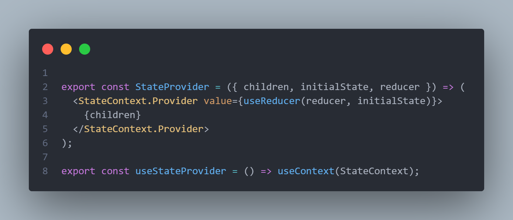
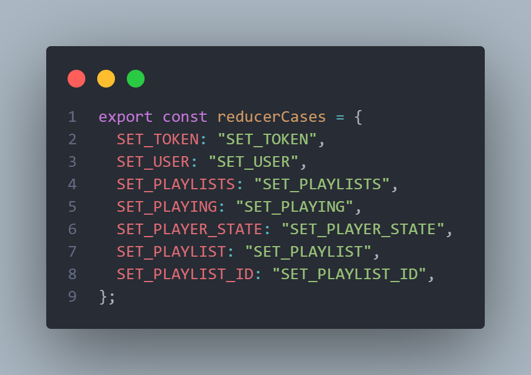
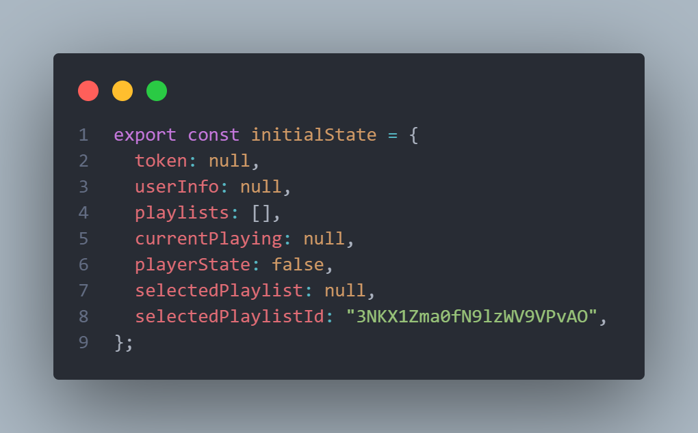
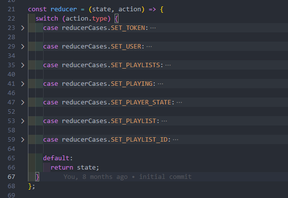

# Spotify developed by Felipe Teles

## Como rodar

```bash
# instale as dependencias
# lembrando que este comanndo
# só é necessário
# na primeira vez
$ npm i

# tendo a pasta node_modules
# basta iniciar o projeto
$ npm start

```

## Context

Criando uma variavel de contexto utilizando o [React.useContext()](https://react.dev/reference/react/useContext):

- `const StateContext = createContext();`

E partir dela fazemos o componente que sera utilizado para armazenas a informação da navegação do usuário:



## Reducer

> Primeiro eu os dividi em casos baseado na aplicação:
> 

> Em seguida foi definido um Initial State
> 

> E por fim utilizo um switch para fazer a variação de estados
> 

## Creditos

- Baseado neste [video](https://youtu.be/ajVcLGEw8Xw).
- Escrevendo isso ao som [dessa](https://open.spotify.com/playlist/3DkbPPWe40MpNGRi9uSPTs?si=4bab7e63c917465b).
- Link do meu [linkedin](https://www.linkedin.com/in/felipsteles/).
